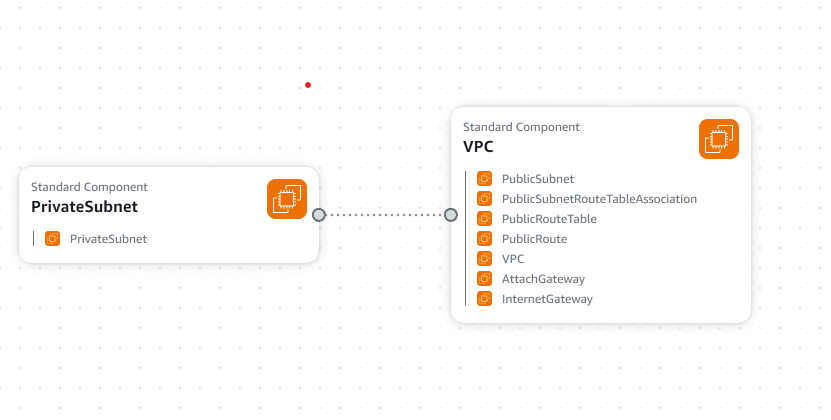

## VPC Settings

These are the VPC Settings that were setup for our AWS cloud environment

VPC UPv4 CIDR Block : 10.200.123.0/24
Ipv6 CIDR Block: No
Number of AZs: 1
Number of private subnet: 1
Number of public subnet: 1
NAT Gateways: None
VPC endpoints: None
DNS options: Enable DNS Hostnames
DNS options: Enable DNS Resolutions

## Generated and Review CFN Tempalte

Watching instructers videos ,I noted the  VPC settins ,provided  LLM to automate to create the CFN,I reviewed the CFN tempalte and refactored it with best practices

## Generated Deploy Script

Using ChatGPT generated a bash script `bin/deploy`

## How to deploy the Script

chmod +x deploy.sh
./deploy.sh
sh deploy.sh

## Visulization in Infrastructure Composer

## Installing AWS cli

In order to deploy via script via aws cli we need to install aws cli.Follow the below link to install aws cli

Follow the below links for Installation Instructions:
https://docs.aws.amazon.com/cli/latest/userguide/getting-started-install.html